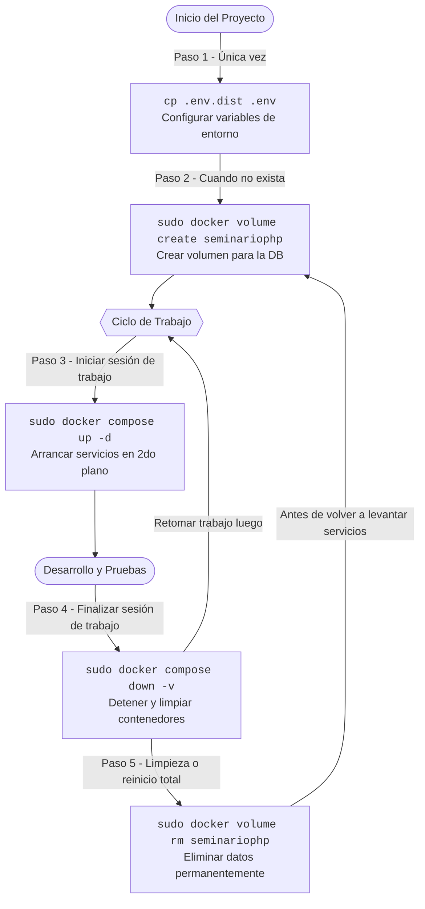

Seminario de PHP, React, y API Rest
===================================

## Configuración inicial

1. Crear archivo `.env` a partir de `.env.dist`

```bash
cp .env.dist .env
```

2. Crear volumen para la base de datos

```bash
sudo docker volume create seminariophp
```

donde *seminariophp* es el valor de la variable `DB_VOLUME`

## Iniciar servicios

```bash
sudo docker compose up -d
```

## Terminar servicios

```bash
sudo docker compose down -v
```

## Eliminar base de datos

```bash
sudo docker volume rm seminariophp
```

## Flujo de uso de comandos

El siguiente diagrama explica la secuencia y el momento en el que debes ejecutar cada comando a lo largo del desarrollo del proyecto:



## Problemas comunes y soluciones

Si encuentras algún error al iniciar o detener los servicios (especialmente errores de red de Docker o puertos en uso), consulta la guía de [Solución de Problemas (TROUBLESHOOTING.md)](./TROUBLESHOOTING.md) para encontrar los pasos detallados para resolverlos.
