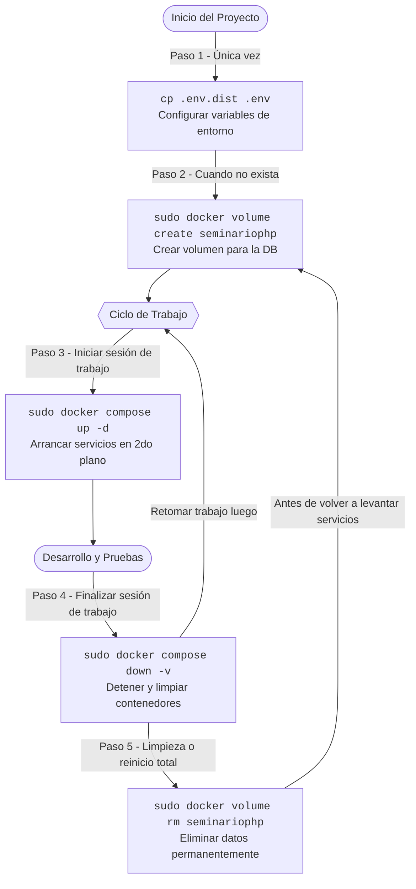

# Seminario PHP, React, y API Rest de Inversiones (UNLP)

## Requisitos
* Docker Desktop

## Lanzador en Windows

Para abrir y cerrar el proyecto sin recordar comandos, ejecuta `lanzador.bat` con doble clic desde la raiz del proyecto.

El menu permite:
* **Abrir proyecto:** crea `.env` si falta, crea el volumen de base de datos si no existe, ejecuta `docker compose up -d` y abre la API y phpMyAdmin en el navegador.
* **Cerrar proyecto:** ejecuta `docker compose down` y conserva los datos del volumen.
* **Ver estado y logs:** muestra contenedores o logs de Docker Compose.
* **Limpiar base de datos:** detiene los servicios y elimina el volumen despues de pedir confirmacion.

Tambien se puede usar desde terminal:
```bat
lanzador.bat abrir
lanzador.bat cerrar
lanzador.bat estado
lanzador.bat logs
lanzador.bat reiniciar
lanzador.bat limpiar-db
```

## Tecnologías y Librerías utilizadas
* **Slim 4**: Framework base.
* **Firebase PHP-JWT**: Autenticación con tokens.
* **PHP-Dotenv**: Variables de entorno.

## Configuración inicial

1. **Crear archivo `.env` a partir de la plantilla**
   
   Copia el archivo y edítalo para configurar las claves reales:
   ```bash
   cp .env.dist .env
   ```

2. **Crear volumen para la base de datos**

   ```bash
   sudo docker volume create seminariophp
   ```
   *Nota: `seminariophp` es el valor de la variable `DB_VOLUME`*.

3. **Iniciar servicios**

   ```bash
   sudo docker compose up -d
   ```

4. **Instalar dependencias de PHP (desde la carpeta /slim)**
   
   Ejecuta composer a través de docker para instalar las librerías necesarias:
   ```bash
   sudo docker run --rm -v ${PWD}:/app composer install
   ```

5. **Importar base de datos**
   
   Dirígete a phpMyAdmin (`localhost:8080`) e importa el archivo `db/schema.sql`.

## Comandos Útiles / Terminar Servicios

* **Bajar servicios y limpiar contenedores:** 
  ```bash
  sudo docker compose down -v
  ```
* **Eliminar base de datos (datos permanentemente):** 
  ```bash
  sudo docker volume rm seminariophp
  ```
* **Ver contenedores activos:** 
  ```bash
  sudo docker ps
  ```

## Flujo de uso de comandos

El siguiente diagrama explica la secuencia y el momento en el que debes ejecutar cada comando a lo largo del desarrollo del proyecto:


```mermaid
graph TD
    A([Inicio del Proyecto]) -->|Paso 1 - Única vez| B[<code>cp .env.dist .env</code><br/>Configurar variables de entorno]
    B -->|Paso 2 - Cuando no exista| C[<code>sudo docker volume create seminariophp</code><br/>Crear volumen para la DB]
    
    C --> D{{Ciclo de Trabajo}}
    
    D -->|Paso 3 - Iniciar sesión de trabajo| E[<code>sudo docker compose up -d</code><br/>Arrancar servicios en 2do plano]
    E --> F([Desarrollo y Pruebas])
    F -->|Paso 4 - Finalizar sesión de trabajo| G[<code>sudo docker compose down -v</code><br/>Detener y limpiar contenedores]
    
    G -->|Retomar trabajo luego| D
    
    G -->|Paso 5 - Limpieza o reinicio total| H[<code>sudo docker volume rm seminariophp</code><br/>Eliminar datos permanentemente]
    H -->|Antes de volver a levantar servicios| C
```

## Problemas comunes y soluciones

Si encuentras algún error al iniciar o detener los servicios (especialmente errores de red de Docker o puertos en uso), consulta la guía de [Solución de Problemas (TROUBLESHOOTING.md)](./TROUBLESHOOTING.md) para encontrar los pasos detallados para resolverlos.

# Correcciones

1. Se modificó el login para devolver el JWT en el header `Authorization`, en lugar del cuerpo de la respuesta.

2. Se mejoraron las validaciones del alta y modificación de usuarios indicando el nombre exacto del campo requerido (`name`, `email`, `password`).

3. Se mejoraron los mensajes de validación de contraseñas indicando los requisitos de seguridad esperados.

4. Se corrigió el endpoint `GET /users` para calcular únicamente el valor del portfolio, según lo solicitado por la consigna.

5. Se eliminó el campo `total_amount` de la respuesta del historial de precios de los activos, devolviendo únicamente la información requerida.

6. Se mejoraron las validaciones de compra de activos indicando los campos obligatorios cuando faltan datos.

7. Se ajustaron los cálculos monetarios para evitar valores con exceso de decimales utilizando redondeo.

# Mejoras adicionales realizadas

1. Se agregó el campo `is_admin` en la respuesta del endpoint `GET /users`.

2. Se agregó el identificador (`userId`) del usuario autenticado en la respuesta del login.

3. Se agregó el nombre (`name`) del usuario autenticado en la respuesta del login.

4. Se configuró la conexión PDO utilizando `ATTR_FOUND_ROWS` para mejorar el comportamiento de las operaciones de actualización.

5. Se incorporó un lanzador (`lanzador.bat`) junto con su documentación para simplificar la puesta en marcha, detención y administración del entorno Docker del proyecto.